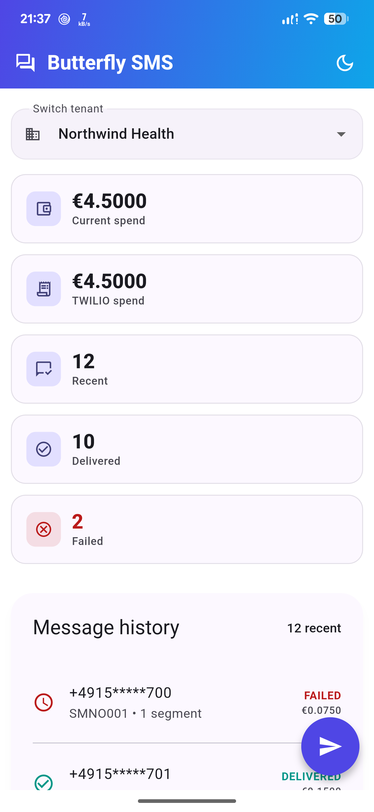
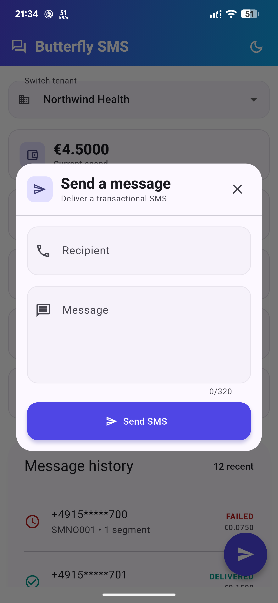
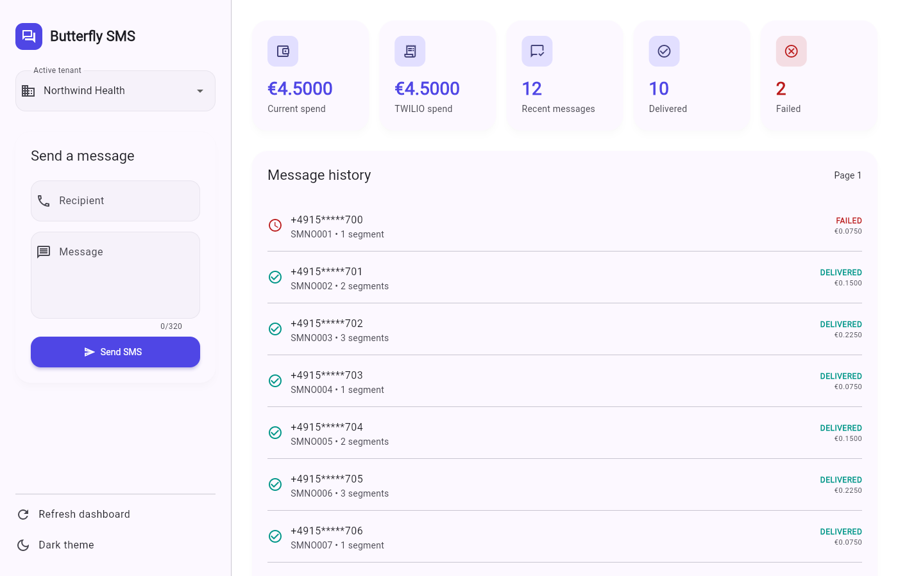

# Butterfly SMS Console

This is my rebuild of the supplied SMS console.

I did not treat it as a visual cleanup.

The original problems were mainly security, money, tenant isolation, and failed async flows.

The app runs with a fake repository by default.

The assignment explicitly allows a stub because the real backend is not supplied.

I also added `HttpSmsRepository`.

This shows how I would connect the same UI and Cubit to the real API without bringing the old insecure code back.

---

## How I Ran It

I used Flutter 3.44.5 stable and Dart 3.12.2.

```bash
flutter pub get
flutter run -d chrome
flutter run -d <android-device-id>
dart format --output=none --set-exit-if-changed lib test
flutter analyze
flutter test
```

I only regenerate the golden when I intentionally approve a visual change.

```bash
flutter test --update-goldens test/golden_test.dart
```

CI pins Flutter 3.44.5.

Ubuntu runs formatting, analysis, and the 19 platform-neutral tests.

Windows runs the tagged golden because the committed pixels were generated on Windows.

I split these jobs after the first CI version incorrectly compared a Windows golden on Ubuntu.

---

## What I Changed

### State management

I used `flutter_bloc` with `SmsConsoleCubit` and an immutable `SmsConsoleState`.

The widgets only render state and call Cubit methods.

They do not know whether data comes from the fake or HTTP repository.

I chose Cubit instead of full event-based Bloc.

This screen has four clear commands: refresh, send, load more, and switch tenant.

Full Bloc would add events and handlers without solving an extra problem here.

My full reasoning is in [ADR 0001](adr/0001-state-management-and-adaptive-layout.md).

### Project structure

```text
lib/
├── app.dart
├── main.dart
├── sms_console.dart
├── core/
│   └── logging/
│       └── app_logger.dart
├── data/
│   ├── fake_sms_repository.dart
│   └── http_sms_repository.dart
├── domain/
│   ├── models.dart
│   └── sms_repository.dart
├── presentation/
│   ├── sms_console_controller.dart
│   ├── sms_console_page.dart
│   └── widgets/
│       ├── body.dart
│       ├── common_widgets.dart
│       ├── history.dart
│       ├── layout_info.dart
│       ├── metric_dashboard.dart
│       ├── mobile_history_page.dart
│       ├── mobile_send_dialog.dart
│       ├── sidebar.dart
│       └── widgets.dart
└── theme/
    └── app_theme.dart
```

I kept the structure small because this is one feature.

I did not add empty use-case classes or layers only to make the folder tree look more complicated.

### Exact money

The API sends money as decimal strings with four decimal places.

My `Money` value stores ten-thousandths as an integer.

It keeps the ISO currency code with the amount.

It never uses `double`.

This means:

```text
0.0079 × 3 = 0.0237 exactly
```

Adding EUR to USD throws instead of producing a believable but invalid total.

The UI formats the actual API or fake response cost.

It does not calculate a guessed provider rate.

### Fake and HTTP repositories

`FakeSmsRepository` is the default.

This means a reviewer can run every screen without a backend or credentials.

It provides:
- Bounded delay
- Masked recipients
- Authoritative fake costs
- Accepted sends
- Typed failures
- Opaque cursor tokens

`HttpSmsRepository` is the real network boundary.

I rebuilt the useful intent from the sb_sms.

I did not reuse its unsafe constants or request code.

It does the following:
- Rejects a non-HTTPS base URL
- Gets a short-lived access token from an injected provider
- Sends `Authorization` and `X-Tenant-Id` on every request
- Applies a timeout
- Maps `400`, `401`, `403`, `429` with `Retry-After`, and `502` to typed failures
- Parses JSON inside the data layer
- Passes history cursors through without decoding them

When the real authentication composition is wired, `HttpSmsRepository.configuredBaseUri()` reads the base URL from:

```bash
flutter run --dart-define=SMS_API_BASE_URL=https://example.invalid
```

That define is configuration only.

It does not switch the default fake repository by itself.

The HTTP repository also needs an injected access-token provider.

Tokens and provider secrets must never be compiled into Flutter.

`RefreshingSmsRepository` retries an unauthorized operation once after refresh.

A failed refresh or a second unauthorized response becomes a session-expired failure.

This means it cannot loop forever.

### Tenant isolation

I treat tenant switching as a security boundary.

Switching tenant immediately clears cost, history, cursor, accepted receipt, error, and rate-limit state.

Every request captures both its tenant and a generation number.

If Tenant A completes after the user has moved to Tenant B, the Cubit ignores A's result.

The regression test deliberately completes the requests in the wrong order.

### Debug logging

I use the `logger` package through one wrapper: `AppLogger`.

I do not create `Logger()` instances in features.

The wrapper accepts fixed `AppLogEvent` values instead of arbitrary user data.

I log lifecycle events such as `sendStarted`, `sendAccepted`, `refreshFailed`, and `tokenRefreshStarted`.

I do **not** log:
- Access or refresh tokens
- Authorization headers
- Recipient numbers
- SMS bodies
- Tenant identifiers
- Full URLs or query parameters

When an exception is logged, `AppLogger` records only its runtime type, not its message.

The `logger` package's `DevelopmentFilter` suppresses these logs in release builds.

A test passes a token, full phone number, and message text inside an exception.

The test proves none of them reach the log output.

### Send flow and user states

The form validates an E.164-like recipient before calling the repository.

The UI disables the action while sending.

The Cubit has a second guard.

This means two fast submissions still create one repository call.

A 202 response is shown as "Accepted by provider," not delivered.

`429` starts a visible retry countdown and blocks another send.

A provider failure says that no message was sent.

Every loading flag has a success or failure exit.

I extracted these reusable boundaries:
- `SendSmsForm` owns text fields and validation display.
- `CostBreakdownRow` renders provider totals without inventing recipients.
- `HistoryTile` renders already-masked history records.
- `StatePanel` handles empty and recoverable error states consistently.

---

## Tests I Added

The suite currently has 20 tests: 19 platform-neutral tests and one golden.

- Exact decimal multiplication, malformed decimals, and mixed currencies
- Required auth and tenant headers
- HTTPS enforcement and typed response parsing
- `429`, `502`, timeout, and malformed-response handling
- Opaque cursor forwarding and fake pagination
- Refresh once and session-expired termination
- Slow Tenant A not overwriting Tenant B
- Rapid duplicate send producing one billable call
- Successful send returning `sending` to false
- Invalid phone validation
- Provider failure recovery
- Accepted-not-delivered wording
- Logging output not exposing error contents
- The 360 px light-theme golden

Commands I ran successfully before this documentation update:

```text
dart format: clean
flutter analyze: no issues
flutter test --exclude-tags golden: 19 passed
flutter test test/golden_test.dart: 1 passed
```

---

## Platforms I Actually Checked

I ran Part 4 on 12 July 2026.

- Pixel 7 Pro over wireless ADB, Android 17/API 37, Impeller Vulkan
- Chrome 150 on Windows at 360×900
- Chrome 150 on Windows at 1400×900

| Home (Pixel 7 Pro) | History (Pixel 7 Pro) | Dialog (Pixel 7 Pro) |
|---|---|---|
|  |  |  |

### Chrome Desktop (1400×900)



### What I noticed across platforms

At 360 px I needed a compact labelled tenant button, one scrolling column, and a `FloatingActionButton` that opens a sleek modal dialog to compose SMS messages.

At 1400 px I used a 410 px action/spend rail and gave the remaining width to history.

I capped the content instead of stretching it edge to edge.

I transitioned smoothly between the mobile and desktop states using `AnimatedSwitcher` and `AnimatedContainer`.

To support a premium desktop and mobile feel, I implemented a custom "pure black" OLED dark mode.

It forces `#000000` backgrounds with distinct white borders, overriding the default Material tinted surfaces.

`SafeArea` kept the Pixel status and navigation areas clear.

Android and Chrome use different font metrics.

Flexible rows and no fixed text heights prevented clipping in the captures.

Flutter Web uses a canvas.

This means normal browser DOM automation does not see all controls until Flutter's accessibility bridge is active.

I therefore kept widget semantics tests as well as visual browser checks.

I made message IDs selectable for desktop.

TalkBack, VoiceOver, and full physical-keyboard traversal still need dedicated manual passes.

---

## What I Deliberately Did Not Do

I did not build a backend, bulk SMS UI, complete sign-in flow, secure token persistence, WebSocket client, localization, analytics, or complex animations.

These were outside the 6–8 hour assignment priority.

Some are not defined by the API contract.

The contract does not define push delivery updates.

I therefore used manual refresh instead of inventing an endpoint.

---

## What I Would Do With Another Week

I would connect `HttpSmsRepository` to the real identity flow and platform secure storage.

I would add cancellation as well as generation checks.

I would expand fake delivery-status progression.

I would run TalkBack and VoiceOver.

I would add verified iOS, Windows, and macOS runs.

---

## Security Notes

The runtime has no API or provider secret, access token, refresh token, full recipient log, or cleartext service URL.

I retained `lib/sms_console.dart` only as the reviewed Part 1 artifact.

It is not imported by the app.

The original credential literal was redacted before the public repository was created.